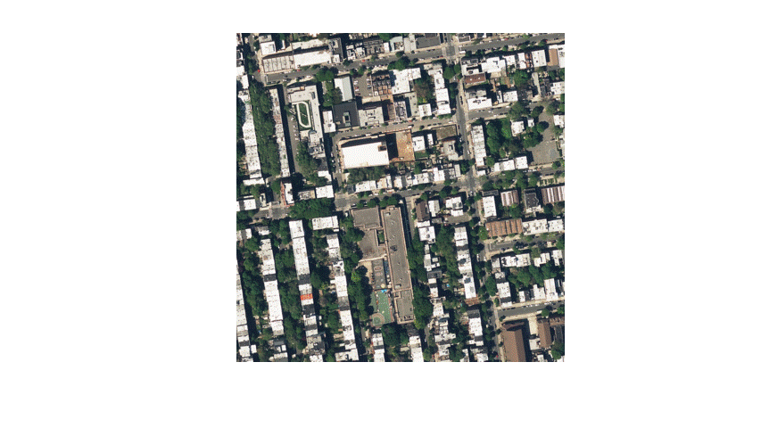
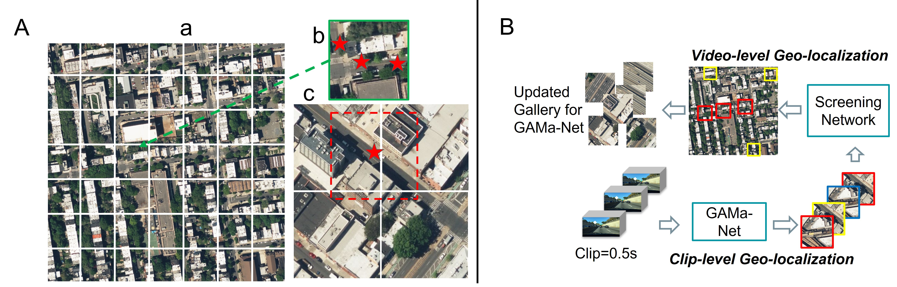
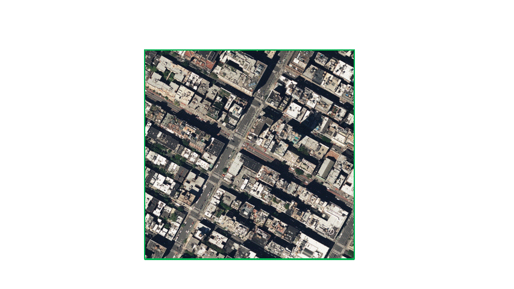

# GAMa: Cross-view Video Geo-localization 
by [Shruti Vyas](https://scholar.google.com/citations?user=15YqUQUAAAAJ&hl=en); [Chen Chen](https://scholar.google.com/citations?user=TuEwcZ0AAAAJ&hl=en); [Mubarak Shah](https://scholar.google.com/citations?user=p8gsO3gAAAAJ&hl=en)
## GAMa (Ground-video to Aerial-image Matching)

### Repository by [Shruti Vyas](https://scholar.google.com/citations?user=15YqUQUAAAAJ&hl=en)

This is a PyTorch repository for our ECCV 2022 paper titled: ["GAMa: Cross-view Video Geo-localization".](https://arxiv.org/abs/2207.02431)

 

In the gif, we see an example of a large aerial region, along with the video frames at each second.

## Dataset and Hierarchical approach



### Dataset
The dataset comprises of one large aerial image (1792x1792) corresponding to each video of around 40 sec. In Figure A, we see an example of a large aerial image, along with the small aerial images. We have a centered (CN) and an uncentered (UCN) set of small aerial images corresponding to the clips of 1 second each. More details are [here.](https://arxiv.org/abs/2207.02431)

### Approach: 
We have four steps in this approach (Figure B). In Step-1, we use GAMa-Net which takes one clip (0.5 sec) at a time and matches with an aerial image.
Using multiple clips of a video, we get a sequence of aerial images for the whole video, i.e. around 40 small aerial images. In Step-2, we use these predictions of aerial images and match them to the corresponding larger aerial region. We use a screening network to match the features however the features are from the
same view i.e aerial view. In Step-3, we use the predictions to reduce the gallery by only keeping top ranked large aerial regions corresponding to a video. These large aerial regions define our new gallery for a given video. In Step-4, we use GAMa-Net i.e. the same network as in Step-1, however geo-localize using the updated gallery.



The gif shows an example of large aerial region for a video and ground truth trajectory as marked by the green line. Initially, only few of the top-1 images matched by GAMa-Net are in the region (White boxes with numbers). The number represent the order of the clip in the video. After using updated gallery by hierarchical approach we have many more predictions in the correct region (Green boxes with numbers). At the end, we also show the outlier that do not fall in the correct larger aerial region.


## GAMa (Ground-video to Aerial-image Matching) dataset

Aerial images of GAMa dataset can be downloaded from this [link.](
https://nam02.safelinks.protection.outlook.com/?url=https%3A%2F%2Fwww.crcv.ucf.edu%2Fdata1%2FGAMa%2F&amp;data=05%7C01%7Cshruti%40crcv.ucf.edu%7C307850d8ddd443dcaa3108da6a82a1a8%7Cbb932f15ef3842ba91fcf3c59d5dd1f1%7C0%7C0%7C637939406540630080%7CUnknown%7CTWFpbGZsb3d8eyJWIjoiMC4wLjAwMDAiLCJQIjoiV2luMzIiLCJBTiI6Ik1haWwiLCJXVCI6Mn0%3D%7C3000%7C%7C%7C&amp;sdata=AekpMwQcG847RxVQD6w63pWMqHYhHBS%2B57fFiwrgFp0%3D&amp;reserved=0 )

Ground videos can be downloaded from BDD-100k dataset:
https://bdd-data.berkeley.edu/  


## GAMa-Net
### System Requirements:
- anaconda3
- Opencv3.5, Numpy, Matplotlib
- Pytorch3, Python 3.6.9

### Evaluation of Hierarchical approach


### Final Evaluation of GAMa-Net model on updated/new gallery: 

- Run the following script for evaluation
	```
	python ./GAMa_Net/evaluationC_pred_Laerial_test_top1per.py
	```

-- Please note that the first time evaluation will take longer to create a dictionary; after that evaluation will be faster
	
More details regarding training and evaluation are in Readme.txt file.

## Cite

```
@inproceedings{vyas2022gama,
  title={GAMa: Cross-view Video Geo-localization},
  author={Vyas, Shruti and Chen, Chen and Shah, Mubarak},
  booktitle={European Conference on Computer Vision},
  year={2022},
  organization={Springer}
}
```
