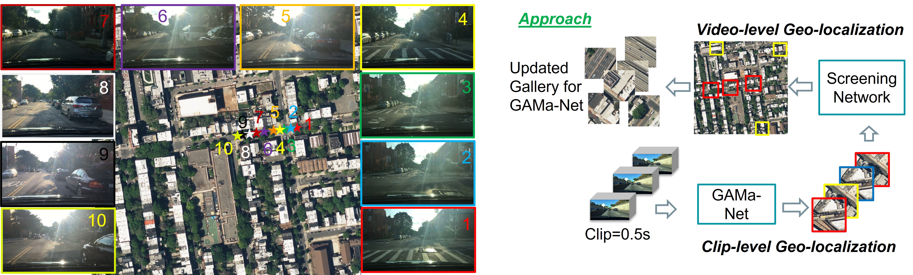

# GAMa: Cross-view Video Geo-localization
GAMa (Ground-video to Aerial-image Matching)
By [Shruti Vyas](https://scholar.google.com/citations?user=15YqUQUAAAAJ&hl=en)

This is the repository for ECCV 2022 paper titled: ["GAMa: Cross-view Video Geo-localization".](https://arxiv.org/abs/2207.02431)

## Dataset and Hierarchical approach

### Approach: We have four steps in this approach. In Step-1, we use GAMa-Net which takes one clip (0.5 sec) at a time and matches with an aerial image.
Using multiple clips of a video, we get a sequence of aerial images for the whole video, i.e. around 40 small aerial images. In Step-2, we use these predictions of aerial images and match them to the corresponding larger aerial region. We use a screening network to match the features however the features are from the
same view i.e aerial view. In Step-3, we use the predictions to reduce the gallery by only keeping top ranked large aerial regions corresponding to a video. These large aerial regions define our new gallery for a given video. In Step-4, we use GAMa-Net i.e. the same network as in Step-1, however geo-localize using the updated gallery.

GAMa (Ground-video to Aerial-image Matching) dataset

Aerial images of GAMa dataset can be downloaded from this [link:](
https://nam02.safelinks.protection.outlook.com/?url=https%3A%2F%2Fwww.crcv.ucf.edu%2Fdata1%2FGAMa%2F&amp;data=05%7C01%7Cshruti%40crcv.ucf.edu%7C307850d8ddd443dcaa3108da6a82a1a8%7Cbb932f15ef3842ba91fcf3c59d5dd1f1%7C0%7C0%7C637939406540630080%7CUnknown%7CTWFpbGZsb3d8eyJWIjoiMC4wLjAwMDAiLCJQIjoiV2luMzIiLCJBTiI6Ik1haWwiLCJXVCI6Mn0%3D%7C3000%7C%7C%7C&amp;sdata=AekpMwQcG847RxVQD6w63pWMqHYhHBS%2B57fFiwrgFp0%3D&amp;reserved=0 )

For ground videos please go to BDD-100k dataset:
https://bdd-data.berkeley.edu/  

